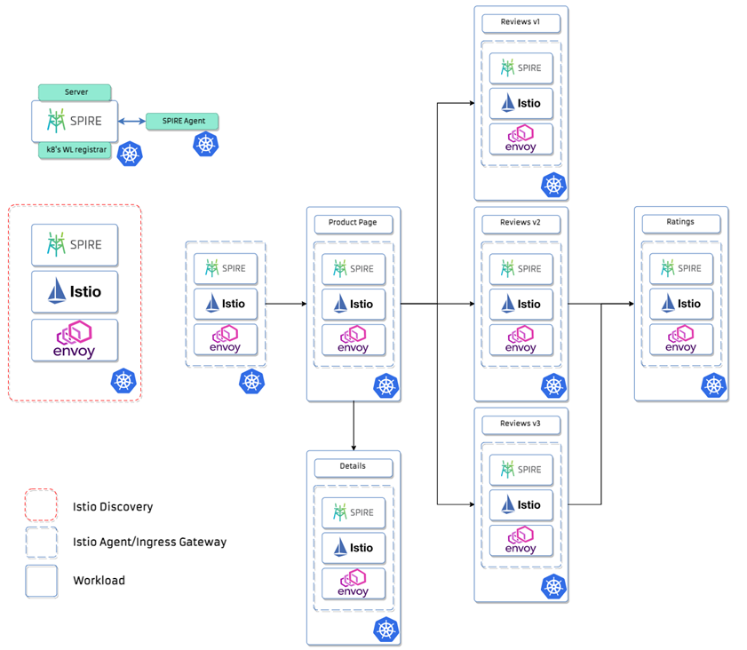

# Mithril POC

[](https://jenkins.docker.hpecorp.net/job/sec-eng/job/istio-spire/job/master/)

This POC is a WIP. 

Currently, it deploys to local `kind` cluster the istio `bookinfo` example configured using static secrets that were 
generated from SVIDs issued by SPIRE. The four workloads from the example (details, productpage, ratings, and reviews) 
are deployed in the `default` namespace.

This POC requires at least 20GB of disk space and 2 CPUs, keep that in mind when setting up a VM. 

## Minimal configuration

- 4 CPUs
- 8 GB RAM
- 20 GB (for POC *only*)

### Build requirements

- docker
- rpmbuild
- fpm
- make
- go 1.16

### No build requirements

- docker

### Install kubectl client

[Install the kubernetes client for your operating system](https://kubernetes.io/docs/tasks/tools/#kubectl)

### Install istioctl

```
curl -L https://istio.io/downloadIstio | ISTIO_VERSION=1.10.1 sh -
```

Should work with istio `1.10.x` and `1.11.x`.

## Install Kind 

Follow [kind install instructions](https://kind.sigs.k8s.io/docs/user/quick-start/#installation)

## Create the cluster and the local docker registry

```bash
./create-kind-cluster.sh
```

# Mithril Images

We can build and deploy our custom Istio images or simply deploy the already built images stored in our public/private ecr's.

## Build Istio images

1. Clone https://github.com/istio/istio
Note: You will need to clone the main Istio repo to $GOPATH/src/istio.io/istio for the build commands to work correctly.
2. `git checkout release-1.10`
3. Apply patch `POC/patches/poc.release-1.10.patch`
4. `export TAG=my-build`
5. `export HUB=localhost:5000`
6. `export BUILD_WITH_CONTAINER=0`
7. `make push`

Note: steps 2 and 3 can be also be done with istio branches `release-1.11` and `master` using the corresponding patches
`poc.release-1.11.patch` and `poc.master.patch`.

This will create the docker images with the tag `my-build`, and push them to the local docker registry (`localhost:5000`).

(More info about building istio: https://github.com/istio/istio/wiki/Preparing-for-Development)

## Elastic Container Registry images

Note: Depending on your environment, there may be firewall-related issues while trying to pull the images. It can be prevented by building Istio images locally.

### Running the POC with images from the public ECR

```bash
TAG=stable \
HUB=public.ecr.aws/e4m8j0n8/mithril \
./deploy-all.sh
```

### Running the POC with images from the private ECR

Install AWS CLI and configure it, follow [aws cli install and configure instructions.](https://aws.amazon.com/cli/?nc1=h_ls)
Note: It may be necessary to request access to the private ECR
```bash
TAG=latest \
HUB=529024819027.dkr.ecr.us-east-1.amazonaws.com/mithril \
./create-docker-registry-secret.sh \
./deploy-all.sh
```

### Running the POC with local registry

Before running the deploy script, specify your trust domain and cluster name on the spire server config at `spire/server-configmap.yaml`

```bash
TAG=my-build \
HUB=localhost:5000 \
./deploy-all.sh
```

The output should look like: 

```
namespace/istio-system created
secret/istio created
secret/istio.istio-ingressgateway-service-account created
configmap/istio-ca-root-cert created
✔ Istio core installed                                                                                                                                                                                                        
✔ Istiod installed                                                                                                                                                                                                            
✔ Ingress gateways installed                                                                                                                                                                                                  
✔ Installation complete                                                                                                                                                                                                       Thank you for installing Istio 1.10.  Please take a few minutes to tell us about your install/upgrade experience!  https://forms.gle/KjkrDnMPByq7akrYA
peerauthentication.security.istio.io/default created
namespace/spire created
clusterrolebinding.rbac.authorization.k8s.io/k8s-workload-registrar-role-binding created
clusterrole.rbac.authorization.k8s.io/k8s-workload-registrar-role created
configmap/k8s-workload-registrar created
Warning: apiextensions.k8s.io/v1beta1 CustomResourceDefinition is deprecated in v1.16+, unavailable in v1.22+; use apiextensions.k8s.io/v1 CustomResourceDefinition
customresourcedefinition.apiextensions.k8s.io/spiffeids.spiffeid.spiffe.io created
serviceaccount/spire-server created
configmap/spire-bundle created
clusterrole.rbac.authorization.k8s.io/spire-server-trust-role created
clusterrolebinding.rbac.authorization.k8s.io/spire-server-trust-role-binding created
configmap/spire-server created
statefulset.apps/spire-server created
service/spire-server created
serviceaccount/spire-agent created
clusterrole.rbac.authorization.k8s.io/spire-agent-cluster-role created
clusterrolebinding.rbac.authorization.k8s.io/spire-agent-cluster-role-binding created
configmap/spire-agent created
daemonset.apps/spire-agent created
secret/istio.details created
secret/istio.productpage created
secret/istio.ratings created
secret/istio.reviews created
configmap/istio-ca-root-cert created
service/details created
serviceaccount/details created
deployment.apps/details-v1 created
service/ratings created
serviceaccount/ratings created
deployment.apps/ratings-v1 created
service/reviews created
serviceaccount/reviews created
deployment.apps/reviews-v1 created
deployment.apps/reviews-v2 created
deployment.apps/reviews-v3 created
service/productpage created
serviceaccount/productpage created
deployment.apps/productpage-v1 created
gateway.networking.istio.io/bookinfo-gateway created
virtualservice.networking.istio.io/bookinfo-service created
destinationrule.networking.istio.io/enable-mtls created
```

Wait for all pods are to reach `Running` state:

```bash
kubectl get pods -A
```

Expected output: 

```
NAMESPACE            NAME                                         READY   STATUS    RESTARTS   AGE
default              details-v1-c658fff7-cvj8d                    2/2     Running   0          6m19s
default              productpage-v1-5f85c6d9d8-mb6jm              2/2     Running   0          6m18s
default              ratings-v1-66db75fdb9-jv4ln                  2/2     Running   0          6m19s
default              reviews-v1-dbcbb4f7c-jzkh5                   2/2     Running   0          6m19s
default              reviews-v2-64854577cd-cw7zw                  2/2     Running   0          6m18s
default              reviews-v3-bd5fcc875-8b722                   2/2     Running   0          6m18s
istio-system         istio-ingressgateway-849d55784b-fwz7m        1/1     Running   0          6m36s
istio-system         istiod-5c79c669f9-7qx5m                      1/1     Running   0          6m49s
kube-system          coredns-74ff55c5b-pl5wd                      1/1     Running   0          19m
kube-system          coredns-74ff55c5b-zq798                      1/1     Running   0          19m
kube-system          etcd-kind-control-plane                      1/1     Running   0          19m
kube-system          kindnet-cxrzk                                1/1     Running   0          19m
kube-system          kube-apiserver-kind-control-plane            1/1     Running   0          19m
kube-system          kube-controller-manager-kind-control-plane   1/1     Running   0          19m
kube-system          kube-proxy-xzjgd                             1/1     Running   0          19m
kube-system          kube-scheduler-kind-control-plane            1/1     Running   0          19m
local-path-storage   local-path-provisioner-78776bfc44-4dp4x      1/1     Running   0          19m
spire                spire-agent-w9jfd                            1/1     Running   0          6m21s
spire                spire-server-0                               2/2     Running   0          6m24s
```

### Cluster Overview



### SPIRE Entries
When using [K8S Workload Registrar](https://github.com/spiffe/spire/tree/main/support/k8s/k8s-workload-registrar) for automatic workload registration within Kubernetes, you can check the created entries using the following command:

```
kubectl exec -i -t pod/spire-server-0 -n spire -c spire-server -- /bin/sh -c "bin/spire-server entry show -socketPath /run/spire/sockets/server.sock"
```

## Test example 

### Inside the cluster:

```bash
kubectl exec "$(kubectl get pod  -l app=ratings -o jsonpath='{.items[0].metadata.name}')" -c ratings  -- curl -sS productpage:9080/productpage
```

The output is an HTML page that should not have any error sections. 

### Outside the cluster:

#### Checking the gateways rules created

```yaml
apiVersion: networking.istio.io/v1alpha3
kind: Gateway
metadata:
  name: bookinfo-gateway
spec:
  selector:
    istio: ingressgateway
  servers:
    - port:
        number: 8080
        name: http
        protocol: HTTP
      hosts:
        - "*"
---
apiVersion: networking.istio.io/v1alpha3
kind: Gateway
metadata:
  name: bookinfo-gateway-mtls
spec:
  selector:
    istio: ingressgateway-mtls
  servers:
    - port:
        number: 7080
        name: https
        protocol: HTTPS
      tls:
        mode: ISTIO_MUTUAL
      hosts:
        - "*"
---
apiVersion: networking.istio.io/v1alpha3
kind: VirtualService
metadata:
  name: bookinfo-service
spec:
  hosts:
    - "*"
  gateways:
    - bookinfo-gateway
    - bookinfo-gateway-mtls
  http:
    - match:
        - uri:
            exact: /productpage
        - uri:
            prefix: /static
        - uri:
            exact: /login
        - uri:
            exact: /logout
        - uri:
            prefix: /api/v1/products
      route:
        - destination:
            host: productpage.default.svc.cluster.local
            port:
              number: 9080
---
apiVersion: "networking.istio.io/v1alpha3"
kind: "DestinationRule"
metadata:
  name: "enable-mtls"
spec:
  host: "*.svc.cluster.local"
  trafficPolicy:
    tls:
      mode: ISTIO_MUTUAL
```

Forward host port 8000 to port 8080 (ingressgateway pod port) inside the cluster:

```bash
./forward-port.sh

Forwarding from 127.0.0.1:8000 -> 8080
Forwarding from [::1]:8000 -> 8080
```

#### Make a **HTTP** request from the host:

```bash
curl localhost:8000/productpage
```

Or open in the browser `localhost:8000/productpage`.

The output is an HTML page that should not have any error sections.

#### Make a **HTTPS** request from the host:

Mint SVID in the trust domain `example.org`:

```bash	
$ kubectl exec --stdin --tty -n spire spire-server-0  -- /opt/spire/bin/spire-server x509 mint -spiffeID spiffe://example.org/myservice -socketPath /run/spire/sockets/server.sock	
```

Copy the X509-SVID section of the output to a file `svid.pem`.	
Copy the Private key section of the output to a file `key.pem`.	

Forward host port 7000 to port 7080 (ingressgateway pod port) inside the cluster:

```bash
INGRESS_POD=$(kubectl get pod -l istio=ingressgateway -n istio-system -o jsonpath="{.items[0].metadata.name}")
kubectl port-forward "$INGRESS_POD" 7000:7080 -n istio-system &
```

#### Test TLS request

```bash	
$ curl --cert svid.pem --key key.pem -k -I https://localhost:7000/productpage	

< HTTP/2 200 	
< content-type: text/html; charset=utf-8	
< content-length: 5183	
< server: istio-envoy
< ...	
```

## Clean up

```bash
./cleanup-all.sh
```

# Playaround

There are some configurations and dependencies that have to be met
to correctly deploy Mithril on your custom environment. Let's get through these:

## Istio-SPIRE integration dependencies

### Istio configuration

Let's take a closer look at `istio-config.yaml`:

```yaml
apiVersion: operator.istio.io/v1alpha1
kind: IstioOperator
metadata:
  namespace: istio-system
spec:
  profile: default
  meshConfig:
    trustDomain: example.org
    defaultConfig:
      proxyMetadata:
        # define the ROOT CA that will be used by all istio-agents to connect with istiod using TLS and a JWT token.
        XDS_ROOT_CA: /etc/certs/root-cert.pem
```
This defines the `trustDomain` environment variable and sets a default Istio deployment.
To perform XDS discovery we need to share the CA bundle with all the sidecars,`XDS_ROOT_CA`
sets a path for the bundle check. We can populate this data by making use of the
[k8s notifier](https://github.com/spiffe/spire/blob/main/doc/plugin_server_notifier_k8sbundle.md) plugin
to get bundle updates and write them to a configmap within the same namespace
of the SPIRE Server, and the [synator](https://github.com/TheYkk/synator) to propagate that
configmap to all additional wanted namespaces.

#### SPIRE Server k8s notifier plugin configuration

Configure the k8s notifier plugin in your custom SPIRE `server.conf` file

```yaml
Notifier "k8sbundle" {
    plugin_data {
      namespace = "spire"
      config_map = "trust-bundle"
      config_map_key = "root-cert.pem"
    }
}
```

#### Istio Discovery configuration

- Environment variables:
  - `ENABLE_CA_SERVER`: disables default istiod CA functionality.
  - `PILOT_ENABLE_XDS_IDENTITY_CHECK`: checks that _istio-agent's_ namespace and service account match the ones in the JWT token presented in XDS the connection.
  - `PILOT_CERT_PROVIDER`: sets SPIFFE Workload API as the cert provider for _istiod_.
  - `SPIFFE_ENDPOINT_SOCKET`: sets the SPIFFE Workload API socket path.
- Volume mounts:
  - `spire-agent-socket`: SPIFFE Workload API socket path.
    

```yaml
pilot:
  k8s:
    env:
      - name: ENABLE_CA_SERVER
        value: "false"
      - name: PILOT_ENABLE_XDS_IDENTITY_CHECK
        value: "true"
      - name: PILOT_CERT_PROVIDER
        value: "spiffe"
      - name: SPIFFE_ENDPOINT_SOCKET
        value: "unix:///run/spire/sockets/agent.sock"
    overlays:
      - apiVersion: apps/v1
        kind: Deployment
        name: istiod
        patches:
          - path: spec.template.spec.containers.[name:discovery].volumeMounts[7]
            value:
              name: spire-agent-socket
              mountPath: "/run/spire/sockets/"
              readOnly: true
          - path: spec.template.spec.volumes[7]
            value:
              name: spire-agent-socket
              hostPath:
                path: /run/spire/sockets
                type: Directory
```

#### Istio Agent (sidecar) configuration

- Environment variables:
    - `CA_PROVIDER`: sets SPIFFE Workload API as the cert provider for _istio-agent_.
    - `SPIFFE_ENDPOINT_SOCKET`: sets the SPIFFE Workload API socket path.
- Volume mounts:
    - `spire-agent-socket`: SPIFFE Workload API socket path.

```yaml
ingressGateways:
  - name: istio-ingressgateway
    enabled: true
    label:
      istio: ingressgateway
    k8s:
      overlays:
        - apiVersion: apps/v1
          kind: Deployment
          name: istio-ingressgateway
          patches:
            - path: spec.template.spec.volumes[8]
              value:
                name: spire-agent-socket
                hostPath:
                  path: /run/spire/sockets
                  type: Directory
            - path: spec.template.spec.containers.[name:istio-proxy].volumeMounts[8]
              value:
                name: spire-agent-socket
                mountPath: "/run/spire/sockets/"
                readOnly: true
      env:
        - name: CA_PROVIDER
          value: "spiffe"
        - name: SPIFFE_ENDPOINT_SOCKET
          value: "unix:///run/spire/sockets/agent.sock"
```

We still need to create a couple of configmaps for the istio namespace and for every
namespace that you want to deploy your workloads. The `istio-ca-root-cert` configmap that is required for _istio-agent_ injection. Both configmaps creation should be unnecessary in future releases.

```yaml
# This remains empty but needs to be present because of istio-agent injection
apiVersion: v1
kind: ConfigMap
metadata:
  name: istio-ca-root-cert
  namespace: istio-system
---
# This remains empty but needs to be present because of istio-agent injection
apiVersion: v1
kind: ConfigMap
metadata:
  name: istio-ca-root-cert
  namespace: default
---
```

#### Workload's sidecars configuration

To automatically propagate the _ingressgateway_ configuration to the sidecars
we can make use of [Custom templates](https://istio.io/latest/docs/setup/additional-setup/sidecar-injection/#custom-templates-experimental).

```yaml
sidecarInjectorWebhook:
  templates:
    spire: |
      spec:
        containers:
        - name: istio-proxy
          env:
          - name: CA_PROVIDER
            value: "spiffe"
          - name: SPIFFE_ENDPOINT_SOCKET
            value: "unix:///run/spire/sockets/agent.sock"
          volumeMounts:
            - name: spire-agent-socket
              mountPath: /run/spire/sockets
              readOnly: true
        volumes:
          - name: spire-agent-socket
            hostPath:
              path: /run/spire/sockets
              type: Directory
```

The template holds the same configuration for the `ingressgateway` and can be applied 
to the workloads by adding an annotation to the app's deployment spec in the `template` section,
as in the example below:

```yaml
template:
  metadata:
    labels:
      app: productpage
      version: v1
    annotations:
      inject.istio.io/templates: "sidecar,spire"
```

# Deploying the POC to Amazon EKS

1. Install [kubectl](#install-kubectl-client) and [istioctl](#install-istioctl).

2. Install [eksctl](https://docs.aws.amazon.com/eks/latest/userguide/eksctl.html) and [aws cli](https://docs.aws.amazon.com/cli/latest/userguide/install-cliv2.html).

3. Set up the credentials for AWS.
```bash
aws configure
```

4. Create an EKS cluster. Name the cluster at will, choose a region, and configure an AWS Key Pair or an SSH key (optional). This may take a while.
```bash
eksctl create cluster \
    --name <your-cluster-name> \
    --region us-east-1 \
    --with-oidc \
    --ssh-access \
    --ssh-public-key my-key-pair \
    --managed
```

5. Deploy the latest (master) tag using the images from the ECR repository.
```bash
TAG=latest \
HUB=public.ecr.aws/e4m8j0n8/mithril \
./deploy-all.sh
```
When you are done, you can [clean up your istio deployment](#clean-up), and then delete the EKS cluster.
```bash
eksctl delete cluster --region us-east-1 --name <your-cluster-name>
```
