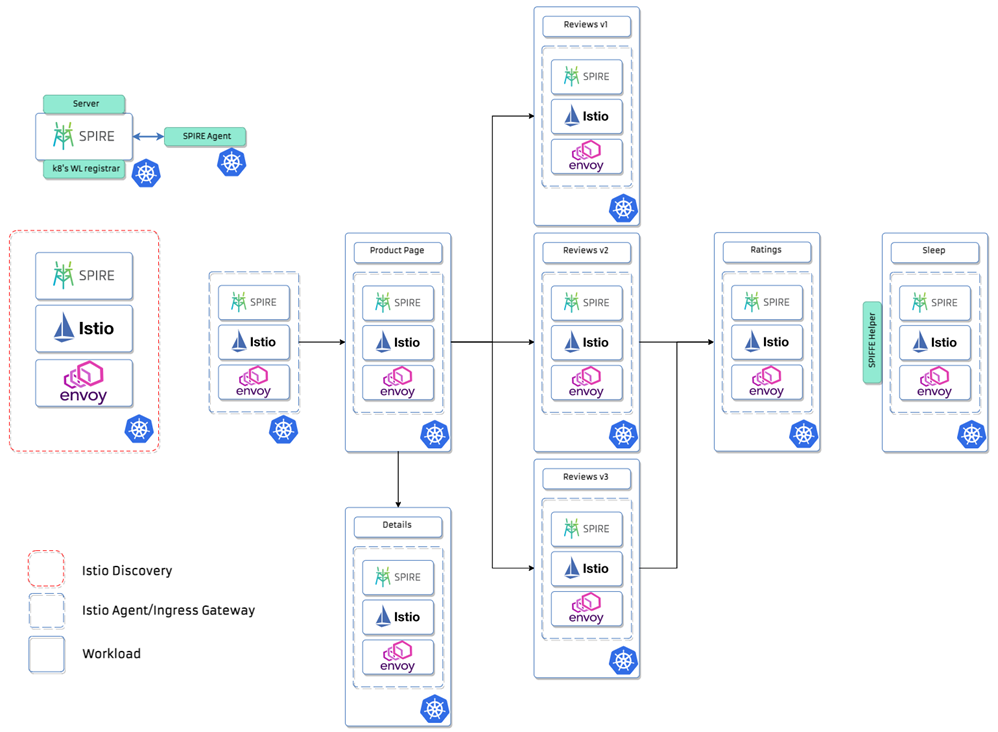
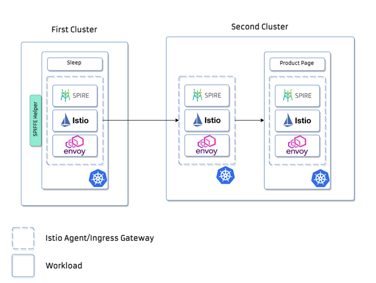
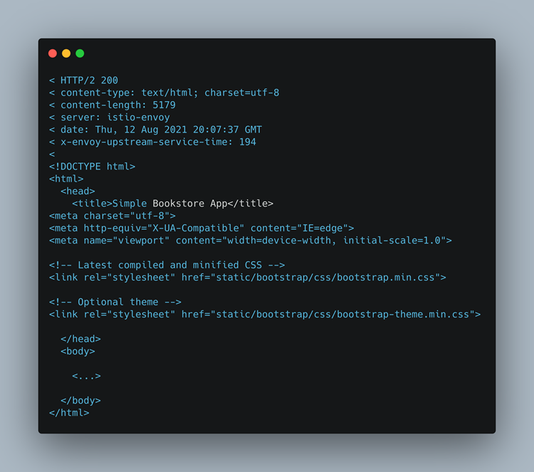
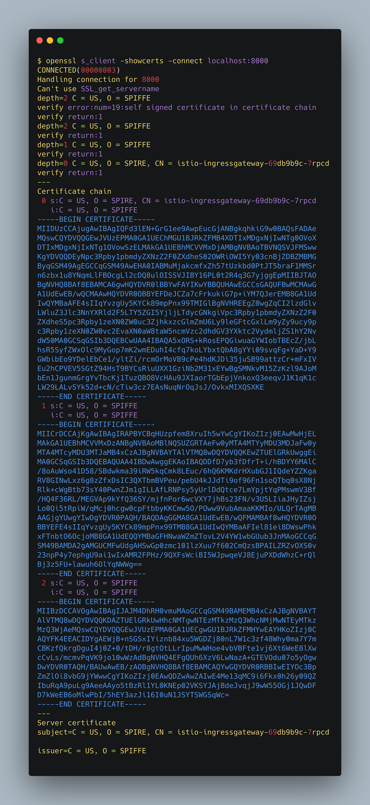

#Connecting two workloads from different Mithril clusters using external disk Spire CA

This section showcases a mTLS between two workloads from different Mithril clusters within the
same trust domain. On this use case both clusters have a SPIRE Server using the ‘disk’ 
UpstreamAuthority plugin that loads CA credentials from disk, more information about this 
SPIRE setup on the UpstreamAuthority disk example.

#Overview



The Mithril changes in Istiod and Istio Agent make possible the use of the SPIRE Workload 
API to fetch identities for every entity within the mesh. The identities for Istiod, Istio 
Ingress, Egress, and for the workloads are all generated by SPIRE by leveraging the k8s 
workload registrar, and then the Istio Agent sidecars of each workload fetch and push their 
credentials materials to be used by the Envoy proxy to communicate and perform mTLS.

#Configuring Istio Ingress Gateway for mTLS

To showcase the mTLS communication between the workloads we will need to configure a Gateway,
a VirtualService and a DestinationRule on the server-side Ingressgateway for it to require 
HTTPS on incoming requests from outside the cluster.

```
apiVersion: networking.istio.io/v1alpha3
kind: Gateway
metadata:
  name: bookinfo-gateway
spec:
  selector:
    istio: ingressgateway
  servers:
    - port:
        number: 8080
        name: https
        protocol: HTTPS
      tls:
        mode: ISTIO_MUTUAL
      hosts:
        - "*"
---
apiVersion: networking.istio.io/v1alpha3
kind: VirtualService
metadata:
  name: bookinfo-service
spec:
  hosts:
    - "*"
  gateways:
    - bookinfo-gateway
  http:
    - match:
        - uri:
            exact: /productpage
        - uri:
            prefix: /static
        - uri:
            exact: /login
        - uri:
            exact: /logout
        - uri:
            prefix: /api/v1/products
      route:
        - destination:
            host: productpage.default.svc.cluster.local
            port:
              number: 9080
---
apiVersion: "networking.istio.io/v1alpha3"
kind: "DestinationRule"
metadata:
  name: "enable-mtls"
spec:
  host: "*.svc.cluster.local"
  trafficPolicy:
    tls:
      mode: ISTIO_MUTUAL
```

Ingress Configuration for the server-side Mithril cluster

Using this configuration, we route requests from outside the cluster to internal services like the /productpage service from the bookinfo example.

##Exposing the ingress gateway of the server cluster

```
INGRESS_POD=$(kubectl get pod -l istio=ingressgateway -n istio-system -o jsonpath="{.items[0].metadata.name}")
kubectl port-forward "$INGRESS_POD" --address 0.0.0.0 8000:8080 -n istio-system
```

#Perform a curl between the workloads

We can deploy and use the [**sleep**](https://github.com/istio/istio/blob/master/samples/sleep/sleep.yaml)
app sample with the necessary annotation template from Mithril on a second cluster 
to use curl and test the connection between the sleep app from the first Mithril 
cluster and the Product Pageservice from the server-side cluster. If you have automatic
sidecar injection enabled:

```
$ kubectl apply -n istio-system -f - <<EOF
apiVersion: v1
kind: ServiceAccount
metadata:
  name: sleep
---
apiVersion: v1
kind: Service
metadata:
  name: sleep
  labels:
    app: sleep
    service: sleep
spec:
  ports:
  - port: 80
    name: http
  selector:
    app: sleep
---
apiVersion: apps/v1
kind: Deployment
metadata:
  name: sleep
spec:
  replicas: 1
  selector:
    matchLabels:
      app: sleep
  template:
    metadata:
      labels:
        app: sleep
      annotations:
        inject.istio.io/templates: "sidecar,spire"
    spec:
      terminationGracePeriodSeconds: 0
      serviceAccountName: sleep
      hostAliases:
        - ip: "10.0.1.50"
          hostnames:
            - "app.example.org"
      initContainers:
        - name: fetch-config
          image: gcr.io/spiffe-io/spire-agent:1.0.0
          command: [ "/bin/sh" ]
          args:
            - "-c"
            - |
              /opt/spire/bin/spire-agent api fetch \
              -socketPath /run/spire/sockets/agent.sock -write . && ls /sleep-certs/ &&
              mv svid.0.key /tmp/sleep-key.pem && \
              mv svid.0.pem /tmp/sleep-svid.pem && \
              mv bundle.0.pem /tmp/root-cert.pem && \
              chmod 644 /tmp/*
          volumeMounts:
            - name: sleep-certs
              mountPath: /sleep-certs
            - name: spire-agent-socket
              mountPath: /run/spire/sockets
              readOnly: false
      containers:
      - name: sleep
        image: curlimages/curl
        command: ["/bin/sleep", "3650d"]
        imagePullPolicy: IfNotPresent
        volumeMounts:
        - mountPath: /etc/sleep/tls
          name: secret-volume
        - name: tmp
          mountPath: /tmp
        - name: spire-agent-socket
          mountPath: /run/spire/sockets
          readOnly: false
      volumes:
      - name: secret-volume
        secret:
          secretName: sleep-secret
          optional: true
      - name: tmp
        emptyDir: {}
      - name: spire-agent-socket
        hostPath:
          path: /run/spire/sockets
          type: Directory
---
EOF
```

Making usage of a **spire-agent** image as an init container we can fetch the identity for the 
**sleep** workload in 
the client cluster (first Mithril cluster) in order to demonstrate the use of a curl with mTLS 
to the Ingressgateway
of the second cluster (server Mithril cluster) that follows the destination rule configured for 
the Product Page service. On this particular example, we have the Ingressgateway of the server
cluster exposed on the endpoint **10.0.1.50** resolved by the hostname **_app.example.org_**
configured on **hostAliases** spec section of the **sleep** app deployment.



```
CLIENT_POD=$(kubectl get pod -l app=sleep -n default -o jsonpath="{.items[0].metadata.name}")
kubectl exec -i -t pod/$CLIENT_POD -c sleep -- /bin/sh -c "curl --cert /tmp/client-cert.pem --key /tmp/client-key.pem --cacert /tmp/root-ca.pem -sSLk http://app.example.org:8000/productpage"
```

#Checking the response from the server:



#Inspecting the credential material for the server workload

```
$ openssl s_client -showcerts -connect localhost:8000
```



 

 

 