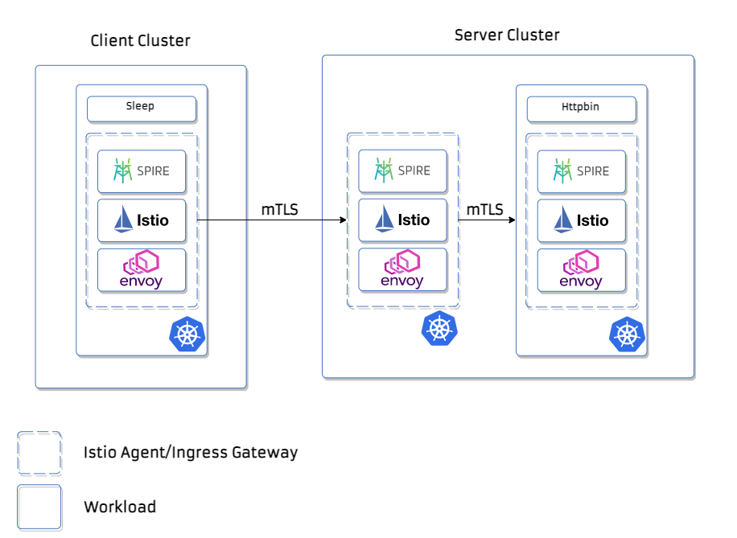

# Connecting two workloads from different Mithril on a Nested Configuration

This section showcases a mTLS between two workloads from different Mithril clusters within the same trust domain and in a Nested SPIRE configuration
using the [‘spire’ UpstreamAuthority plugin](https://github.com/spiffe/spire/blob/main/doc/plugin_server_upstreamauthority_spire.md).
On this particular use case we will create a scenario with a Root SPIRE Server running on
bare metal to serve as an Upstream CA to two 
Nested SPIRE Severs running on two separated Mithril clusters.


# Nested SPIRE k8s topology


# Before you begin

For this Nested Mithril setup, first we need to configure and deploy SPIRE in a nested 
topology in our k8s clusters, to do that we are going to generate certificates and keys
to attest the Agents with the [x509pop Node Attestor](https://github.com/spiffe/spire/blob/v1.1.0/doc/plugin_server_nodeattestor_x509pop.md)
plugin to "chain" our Nested SPIRE Servers to the root SPIRE Server we will run on bare
metal. After generating all the necessary certificates we will bootstrap the Agents and
generate entries for the Nested SPIRE Servers. Let's use the current directory as a 
path for storing the certificates.

# Setting up the environment

We will execute a script to generate all certs, to run the root server on the
background, bootstrap the
agents and create the necessary entries for the downstream servers.
```bash
./set-env.sh
```
### Downstream entries
```bash
./spire-server entry create \
       -parentID "spiffe://example.org/spire/agent/x509pop/$(fingerprint "${DIR}"/nestedA/agent-nestedA.crt.pem)" \
       -spiffeID "spiffe://example.org/ns/spire/sa/spire-server-nestedA" -dns spire-server-0 -dns spire-server.spire.svc \
       -selector "unix:uid:0" \
       -downstream \
       -ttl 3600 -socketPath="/tmp/spire-server/private/api.sock"

./spire-server entry create \
       -parentID "spiffe://example.org/spire/agent/x509pop/$(fingerprint "${DIR}"/nestedB/agent-nestedB.crt.pem)" \
       -spiffeID "spiffe://example.org/ns/spire/sa/spire-server-nestedB" -dns spire-server-0 -dns spire-server.spire.svc \
       -selector "unix:uid:0" \
       -downstream \
       -ttl 3600 -socketPath="/tmp/spire-server/private/api.sock"
```

# Configuring NestedA Mithril Deployment (Server cluster)

We will create a [kind](https://kind.sigs.k8s.io/docs/user/quick-start/) to deploy
 our Nested Mithril setup.

```bash
./server-cluster/create-kind-cluster.sh
```

Then we are going to create configmaps for sharing all necessary certificates and keys 
for attesting the node.

```bash
kubectl create configmap spire-bundle-nest --from-file ../root-cert.pem --namespace="spire"
kubectl create configmap agent-nesteda-cert --from-file ../nestedA/agent-nestedA.crt.pem --namespace="spire"
kubectl create configmap agent-nesteda-key --from-file ../nestedA/agent-nestedA.key.pem --namespace="spire"
```

### Nested Agent configuration

We are going to configure and deploy a SPIRE Agent within the same pod of the NestedA SPIRE Server 
Let's take a look at the nested agent configuration file:
```yaml
apiVersion: v1
kind: ConfigMap
metadata:
name: spire-agent-nest
namespace: spire
data:
agent.conf: |
agent {
data_dir = "/run/spire"
log_level = "DEBUG"
server_address = "root-spire"
server_port = "8081"
socket_path = "/tmp/agent-nestedA.sock"
trust_bundle_path = "/run/spire/upstream/root-cert.pem"
trust_domain = "example.org"
}

    plugins {

      NodeAttestor "x509pop" {
          plugin_data {
              private_key_path = "/run/spire/upstream/agent-nestedA.key.pem"
              certificate_path = "/run/spire/upstream/agent-nestedA.crt.pem"
          }
      }

      KeyManager "memory" {
        plugin_data {
        }
      }

      WorkloadAttestor "unix" {
          plugin_data {
          }
      }
    }

    health_checks {
      listener_enabled = true
      bind_address = "0.0.0.0"
      bind_port = "8082"
      live_path = "/live"
      ready_path = "/ready"
    }
```
The Agent socket `socket_path = "/tmp/agent-nestedA.sock"` is located in an empty
directory so the NestedA SPIRE Server can access it, that way we can configure the ‘spire’ UpstreamAuthority plugin
on NestedA.

### NestedA SPIRE Server configuration

For the Nested SPIRE Servers we only need to configure the **UpstreamAuthority** plugin
and add it to the default configuration of the Mithril SPIRE Server.

```
 UpstreamAuthority "spire" {
 plugin_data {
   server_address = "10.0.1.50", # Endpoint of the Root SPIRE Server
   server_port = "8081",
   workload_api_socket = "/tmp/agent-nestedA.sock"
   }
 }
```

### NestedA SPIRE Server deployment

We will add the deployment configuration for the Agent that we will use to attest
the node to the default deployment CRD of the Mithril SPIRE Server. All the necessary
certificates that we have generated will be mounted on the Agent container for attestation.

```yaml
apiVersion: apps/v1
kind: StatefulSet
metadata:
  name: spire-server
  namespace: spire
  labels:
    app: spire-server
spec:
  replicas: 1
  selector:
    matchLabels:
      app: spire-server
  serviceName: spire-server
  template:
    metadata:
      namespace: spire
      labels:
        app: spire-server
    spec:
      serviceAccountName: spire-server
      hostPID: true
      hostNetwork: true
      dnsPolicy: ClusterFirstWithHostNet
      hostAliases:
        - ip: "10.0.1.50" # Endpoint of the Root SPIRE Server
          hostnames:
            - "root-spire"
      containers:
        - name: spire-server
          image: gcr.io/spiffe-io/spire-server:1.1.0
          args:
            - -config
            - /run/spire/config/server.conf
          livenessProbe:
            httpGet:
              path: /live
              port: 8080
            failureThreshold: 2
            initialDelaySeconds: 15
            periodSeconds: 60
            timeoutSeconds: 3
          readinessProbe:
            httpGet:
              path: /ready
              port: 8080
            initialDelaySeconds: 5
            periodSeconds: 5
          ports:
            - containerPort: 8081
          volumeMounts:
            - name: spire-config
              mountPath: /run/spire/config
              readOnly: true
            - name: spire-data
              mountPath: /run/spire/data
              readOnly: false
            - name: spire-registration-socket
              mountPath: /run/spire/sockets
              readOnly: false
            - name: tmp
              mountPath: /tmp
        - name: k8s-workload-registrar
          image: gcr.io/spiffe-io/k8s-workload-registrar:1.0.0
          args:
            - -config
            - /run/spire/config/k8s-workload-registrar.conf
          ports:
            - containerPort: 9443
              name: webhook
              protocol: TCP
          volumeMounts:
            - mountPath: /run/spire/config
              name: k8s-workload-registrar-config
              readOnly: true
            - name: spire-registration-socket
              mountPath: /run/spire/sockets
              readOnly: true
        - name: spire-agent-nest
          image: gcr.io/spiffe-io/spire-agent:1.0.0
          args: ["-config", "/run/spire/config/agent.conf"]
          volumeMounts:
            - name: spire-config-nest
              mountPath: /run/spire/config
              readOnly: true
            - name: spire-token
              mountPath: /var/run/secrets/tokens
            - name: spire-bundle-nest
              mountPath: /run/spire/upstream/root-cert.pem
              subPath: root-cert.pem
              readOnly: true
            - name: agent-nesteda-cert
              mountPath: /run/spire/upstream/agent-nestedA.crt.pem
              subPath: agent-nestedA.crt.pem
              readOnly: true
            - name: agent-nesteda-key
              mountPath: /run/spire/upstream/agent-nestedA.key.pem
              subPath: agent-nestedA.key.pem
              readOnly: true
            - name: tmp
              mountPath: /tmp
          livenessProbe:
            httpGet:
              path: /live
              port: 8082
            failureThreshold: 2
            initialDelaySeconds: 15
            periodSeconds: 60
            timeoutSeconds: 3
          readinessProbe:
            httpGet:
              path: /ready
              port: 8082
            initialDelaySeconds: 5
            periodSeconds: 5
      volumes:
        - name: spire-config
          configMap:
            name: spire-server
        - name: k8s-workload-registrar-config
          configMap:
            name: k8s-workload-registrar
        - name: spire-registration-socket
          hostPath:
            path: /run/spire/server-sockets
            type: DirectoryOrCreate
        - name: spire-token
          projected:
            sources:
              - serviceAccountToken:
                  path: spire-agent-nest
                  expirationSeconds: 7200
                  audience: spire-server
        - name: spire-config-nest
          configMap:
            name: spire-agent-nest
        - name: spire-bundle-nest
          configMap:
            name: spire-bundle-nest
        - name: agent-nesteda-cert
          configMap:
            name: agent-nesteda-cert
        - name: agent-nesteda-key
          configMap:
            name: agent-nesteda-key
        - name: tmp
          emptyDir: {}
  volumeClaimTemplates:
    - metadata:
        name: spire-data
        namespace: spire
      spec:
        accessModes:
          - ReadWriteOnce
        resources:
          requests:
            storage: 1Gi
```

# Running the Scenario 

The NestedB configuration is analogous to the NestedA so will be omitted on this tutorial.
Use the `./server-cluster/deploy-all.sh` to deploy SPIRE, Istio and the [httpbin](https://github.com/istio/istio/blob/master/samples/httpbin/httpbin.yaml)
workload that we will use for the server side cluster on this example.

```bash
./server-cluster/deploy-all.sh
```

### Configuring Istio Ingress Gateway for mTLS

To showcase the mTLS communication between the workloads we will need to configure a Gateway, a VirtualService and a DestinationRule on the server-side Ingressgateway for it to require HTTPS on incoming requests from outside the cluster.

```yaml
apiVersion: networking.istio.io/v1alpha3
kind: Gateway
metadata:
  name: httpbin-gateway
spec:
  selector:
    istio: ingressgateway # use istio default controller
  servers:
    - port:
        number: 8080
        name: https
        protocol: HTTPS
      tls:
        mode: ISTIO_MUTUAL
      hosts:
        - "*"
---
apiVersion: networking.istio.io/v1alpha3
kind: VirtualService
metadata:
  name: httpbin-service
spec:
  hosts:
    - "*"
  gateways:
    - httpbin-gateway
  http:
    - match:
        - uri:
            prefix: /status
        - uri:
            prefix: /delay
      route:
        - destination:
            port:
              number: 8000
            host: httpbin
---
apiVersion: "networking.istio.io/v1alpha3"
kind: "DestinationRule"
metadata:
  name: "enable-mtls"
spec:
  host: "*.svc.cluster.local"
  trafficPolicy:
    tls:
      mode: ISTIO_MUTUAL
```

That way we can route requests from outside of the cluster to internal services like the **httpbin**.

### Exposing the ingress gateway of the server cluster

```bash
INGRESS_POD=$(kubectl get pod -l istio=ingressgateway -n istio-system -o jsonpath="{.items[0].metadata.name}")
kubectl port-forward "$INGRESS_POD" --address 0.0.0.0 8000:8080 -n istio-system
```

### Deploying client cluster

Use the `./server-cluster/deploy-all.sh` to deploy SPIRE, Istio and the [sleep](https://github.com/istio/istio/blob/master/samples/sleep/sleep.yaml) app
workload that we will use for the server side cluster on this example.

```bash
./client-cluster/create-kind-cluster.sh
./client-cluster/deploy-all.sh
```

### Configuring a service entry for accessing the external httpbin service

```yaml
apiVersion: networking.istio.io/v1alpha3
kind: ServiceEntry
metadata:
  name: app
spec:
  hosts:
  - app.example.org
  ports:
  - number: 8000
    name: https-port
    protocol: HTTP
    targetPort: 8000
  resolution: DNS
---
apiVersion: networking.istio.io/v1alpha3
kind: DestinationRule
metadata:
  name: app
spec:
  host: app.example.org
  trafficPolicy:
    portLevelSettings:
    - port:
        number: 8000
      tls:
        mode: ISTIO_MUTUAL # initiates HTTPS when accessing app.example.org 
```

### Perform a curl between the workloads using Istio mTLS origination



On the client cluster:

```bash
CLIENT_POD=$(kubectl get pod -l app=sleep -n default -o jsonpath="{.items[0].metadata.name}")
kubectl exec -i -t pod/$CLIENT_POD -c sleep -- /bin/sh -c "curl -sSLkv http://app.example.org:8000/status/200"
```

### Checking the response from the server:

```bash
*   Trying 10.0.1.50:8000...
* Connected to app.example.org (10.0.1.50) port 8000 (#0)
> GET /status/200 HTTP/1.1
> Host: app.example.org:8000
> User-Agent: curl/7.79.1-DEV
> Accept: */*
> 
* Mark bundle as not supporting multiuse
< HTTP/1.1 200 OK
< server: envoy
< date: Sun, 03 Oct 2021 21:27:30 GMT
< content-type: text/html; charset=utf-8
< access-control-allow-origin: *
< access-control-allow-credentials: true
< content-length: 0
< x-envoy-upstream-service-time: 2
< 
```

### Inspecting the credential materials of the workloads

```bash
$ openssl s_client -showcerts -connect 10.0.1.50:8000
CONNECTED(00000003)
Can't use SSL_get_servername
depth=2 C = US, O = SPIFFE
verify error:num=19:self signed certificate in certificate chain
verify return:1
depth=2 C = US, O = SPIFFE
verify return:1
depth=1 C = US, O = SPIFFE, OU = DOWNSTREAM-1
verify return:1
depth=0 C = US, O = SPIRE, CN = istio-ingressgateway-5c8d74fb97-7jjnf
verify return:1
---
Certificate chain
 0 s:C = US, O = SPIRE, CN = istio-ingressgateway-5c8d74fb97-7jjnf
   i:C = US, O = SPIFFE, OU = DOWNSTREAM-1
-----BEGIN CERTIFICATE-----
MIIDbzCCAlegAwIBAgIRAOqitjQfMARR/z5PNG9IrQswDQYJKoZIhvcNAQELBQAw
NTELMAkGA1UEBhMCVVMxDzANBgNVBAoTBlNQSUZGRTEVMBMGA1UECxMMRE9XTlNU
UkVBTS0xMB4XDTIxMTAwMzIxMTkxM1oXDTIxMTAwMzIxNTkxNlowTTELMAkGA1UE
BhMCVVMxDjAMBgNVBAoTBVNQSVJFMS4wLAYDVQQDEyVpc3Rpby1pbmdyZXNzZ2F0
ZXdheS01YzhkNzRmYjk3LTdqam5mMFkwEwYHKoZIzj0CAQYIKoZIzj0DAQcDQgAE
Bnh4/9UU79UI4/B8lV5qKMaQPdC5o49dCzCYlYT6v+e8qKkUfja5NpZwndkV2FuJ
e2/KgIHOht3EpuFdXrRFpaOCASswggEnMA4GA1UdDwEB/wQEAwIDqDAdBgNVHSUE
FjAUBggrBgEFBQcDAQYIKwYBBQUHAwIwDAYDVR0TAQH/BAIwADAdBgNVHQ4EFgQU
N7B14vVV0vH47QxmKBKKBIK1dVQwHwYDVR0jBBgwFoAUcouNphnIKBARp9fSQ+Oj
FlYl/GUwgacGA1UdEQSBnzCBnIIlaXN0aW8taW5ncmVzc2dhdGV3YXktNWM4ZDc0
ZmI5Ny03ampuZoIlaXN0aW8taW5ncmVzc2dhdGV3YXkuaXN0aW8tc3lzdGVtLnN2
Y4ZMc3BpZmZlOi8vZXhhbXBsZS5vcmcvbnMvaXN0aW8tc3lzdGVtL3NhL2lzdGlv
LWluZ3Jlc3NnYXRld2F5LXNlcnZpY2UtYWNjb3VudDANBgkqhkiG9w0BAQsFAAOC
AQEAtvyssqDU4kfj5aUl4fgSDOAQFbeqZKjG5VqCVTw21Qf867Jq1koKP3wY9v0h
lAJaluOfwViXMpU3/liyFh+9d+o35rbRWppRaoTmTwYs5/5tdLsIPZCOrS7Fijce
PzrEarPXfx1vzrCGe4ti2VMCz6n1CcGSwiz38tU4WC6qFoQh/b5ZAdCtBmmnRJbJ
ONcLoJWaOGs5AntFfJuvykmViJRkA/YMfJdOObUfEk0d+Sx9czb1TuB/rIrCDw9C
YGxcrFwquTJ6rM8xUJAFEk1slqwhEz20+RfFvapDxiBUgC6R1j0P9f4q1wbGfaKd
b+k6bDDBqkAKsogCXF0mSwfQaw==
-----END CERTIFICATE-----
 1 s:C = US, O = SPIFFE, OU = DOWNSTREAM-1
   i:C = US, O = SPIFFE
-----BEGIN CERTIFICATE-----
MIICojCCAkigAwIBAgIQVVi4qUQwCKuBcI2RdJ4q1DAKBggqhkjOPQQDAjAeMQsw
CQYDVQQGEwJVUzEPMA0GA1UEChMGU1BJRkZFMB4XDTIxMTAwMzIwNTkwNloXDTIx
MTAwMzIxNTkxNlowNTELMAkGA1UEBhMCVVMxDzANBgNVBAoTBlNQSUZGRTEVMBMG
A1UECxMMRE9XTlNUUkVBTS0xMIIBIjANBgkqhkiG9w0BAQEFAAOCAQ8AMIIBCgKC
AQEA2WhV/3t2SjFi86z8fCgTDxdNyp7dUjKyBPzFLL5TVgYDecC6So0AS5WsSFlr
9gIoAqfd7wtoy2OE6lpoYc8edHZj7TMZYvy3W7qsivA3XpX7iW/2s2E/fWCUU3hx
3F/jGHX3enXYgg0INVpL+Oooaj22u3nvzT1cZr9fPMQ6K92OnChXMS6aDKDsXnvp
ootQEDo0I4mODiax6oOp+11Df2Ckc+KK8SRceotufDyA1vDsvqxZZjBYlsNTtewg
eakszrhqMHGmDQWM5mF5RoHHN9RqYHX34SUoZOQCNXkmrgUkeXM9e0ZAPuMXYDeJ
IeX2PRm7v/8Kl1A7ELAVlULQ5wIDAQABo4GFMIGCMA4GA1UdDwEB/wQEAwIBhjAP
BgNVHRMBAf8EBTADAQH/MB0GA1UdDgQWBBRyi42mGcgoEBGn19JD46MWViX8ZTAf
BgNVHSMEGDAWgBQGbUPQ/PIznziF5vBNoOzwaxKDIzAfBgNVHREEGDAWhhRzcGlm
ZmU6Ly9leGFtcGxlLm9yZzAKBggqhkjOPQQDAgNIADBFAiAiz88+ZZxhhGGF6nDf
MIGePf3DnJZiJTRyKODdCAyqzAIhAK/6mRT2jA3YKtn34/rLh3+98ll2zDUkLRHp
hSJFy4IW
-----END CERTIFICATE-----
 2 s:C = US, O = SPIFFE
   i:C = US, O = SPIFFE
-----BEGIN CERTIFICATE-----
MIIBjTCCATSgAwIBAgIBADAKBggqhkjOPQQDAjAeMQswCQYDVQQGEwJVUzEPMA0G
A1UEChMGU1BJRkZFMB4XDTIxMTAwMzAzMjY0NFoXDTIxMTAxMDAzMjY1NFowHjEL
MAkGA1UEBhMCVVMxDzANBgNVBAoTBlNQSUZGRTBZMBMGByqGSM49AgEGCCqGSM49
AwEHA0IABMEMYiqbVz7ypPBHtNyb4ZL9mGKtp2FBiQE6aDjrfIgbZt8j++6kU5n7
toPy2+YVwBF2eaajs8CD977xl22vaQ2jYzBhMA4GA1UdDwEB/wQEAwIBhjAPBgNV
HRMBAf8EBTADAQH/MB0GA1UdDgQWBBQGbUPQ/PIznziF5vBNoOzwaxKDIzAfBgNV
HREEGDAWhhRzcGlmZmU6Ly9leGFtcGxlLm9yZzAKBggqhkjOPQQDAgNHADBEAiBR
JLEuS2Bakvmn5Az8YJV62owMr9WnJV7CP9q3GykGMQIgNNCTTZkEHoDxNvKzZbqx
/m45e9OU/q3ggP7k6vZtMIo=
-----END CERTIFICATE-----
---
Server certificate
subject=C = US, O = SPIRE, CN = istio-ingressgateway-5c8d74fb97-7jjnf

issuer=C = US, O = SPIFFE, OU = DOWNSTREAM-1

---
```
 